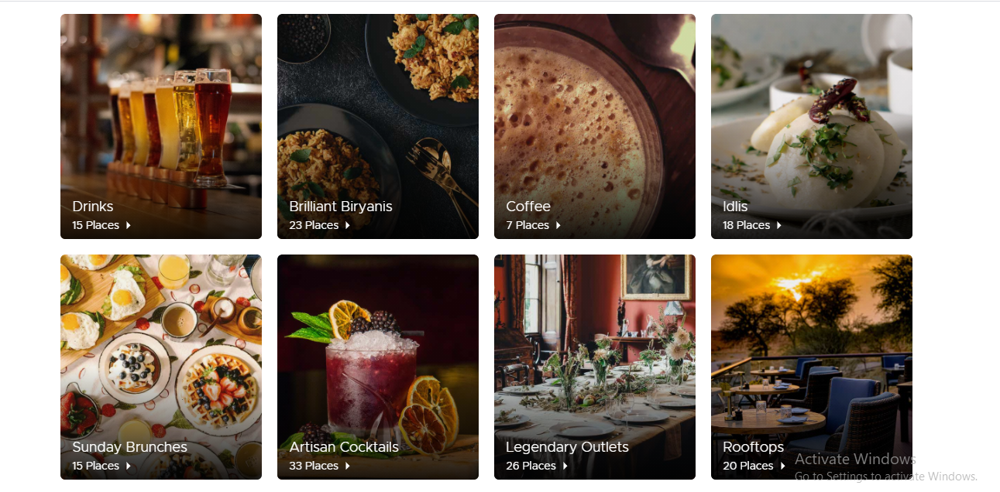
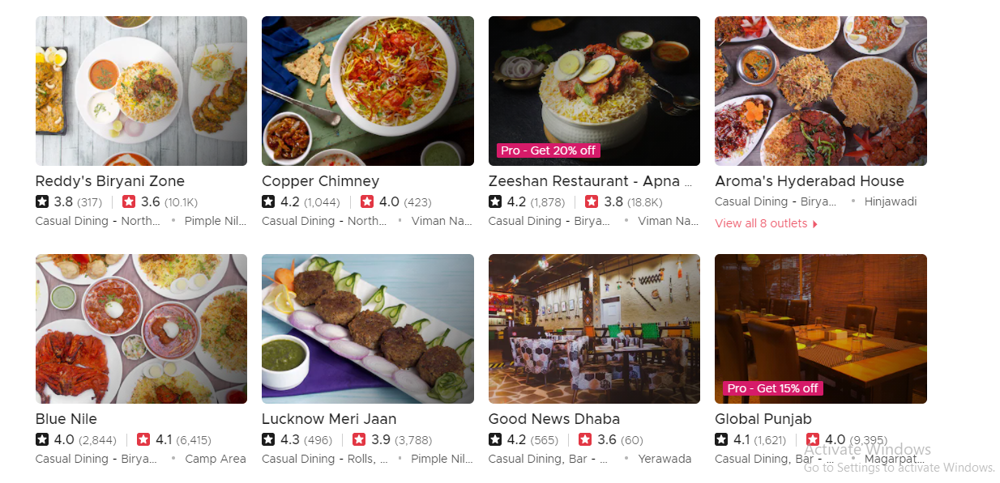

# food-menu

## Pre-requisites:  

<ul>
  <li> NodeJS - You can install nodeJS from https://nodejs.org/en/download/ </li>
</ul>

## Project SetUp:  

<ul> 
  <li> Clone the project </li>
  <li> Open cmd in the root folder of the project and run <code> npm i </code> to install all the dependencies. </li>
</ul>

## How to start the server:  

<ul>
  <li> Open cmd in the root folder of the project and type <code> npm start </code> </li>
</ul>

## Endpoints:  

<ol>
  <li> <strong> /api/categories </strong> - To fetch list of all categories of food.  
    Example Value:  
    <code> 
      [{
        id: 1,
        name: "biryani",
        image: "biryani.jpg",
        count: 5
      }]
    </code>    
    Model:  
    <em> id </em> - category id  
    <em> name </em> - category name  
    <em> image </em> - imag src of category  
    <em> count </em> - count of restaurants serving that category     
  </li>
  <li> <strong> /api/categories/:id </strong> - To fetch list of all restaurants serving selected category of food.  
  Example Value:  
    <code> 
      [{
        id: 1,
        name: "Aroma House",
        image: "biryani.jpg",
        open: true,
        rating: 3.0
      }]
    </code>    
    Model:  
    <em> id </em> - restaurant id  
    <em> name </em> - restaurant name  
    <em> image </em> - imag src of category selected  
    <em> open </em> - restaurant's open status  
    <em> rating </em> - restaurant's rating  
  </li>
</ol>

## Sample Output:  

<ul>
  <li> Categories (1st Page):   
  Description:  
  The first page of the website should show all categories fetched from the api ( <em> /api/categories </em> ) as shown in the below image.
  

    
  

  </li>
   
  <li> Restaurants serving Biryani(2nd Page):   
   Description:  
   On click event of any category e.g. Brilliant Biryanis, the website should show all restaurants serving biryanis fetched from the api ( <em> /api/categories/:id </em> ) as      shown in the below image. 
  

    
  

  </li>
</ul>
